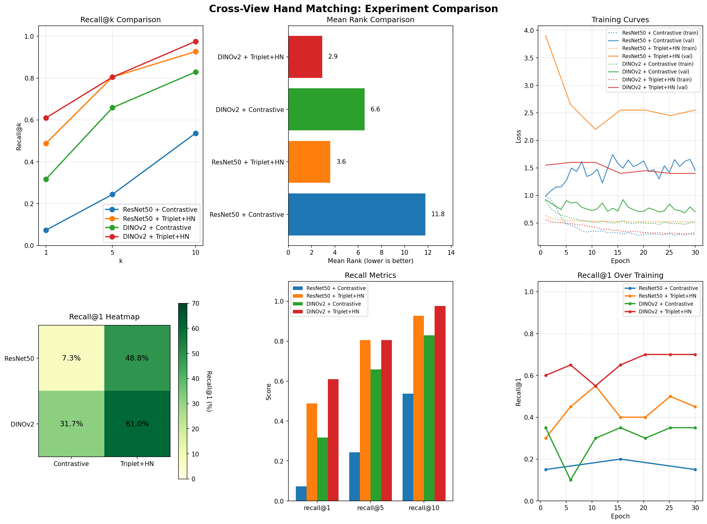
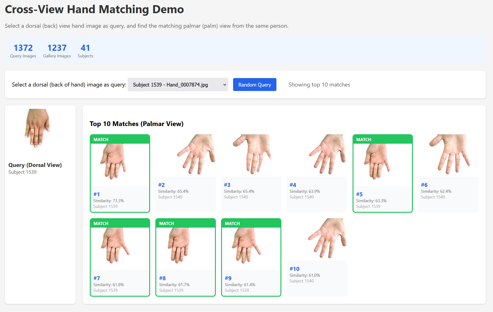

# Dorsal-to-Palmar Hand Matching

Consider reading the [blog post](https://lenixc.github.io/2026/02/02/cross-view-hands.html). It gives a more narrative look into the problem
and why and how I made certain decisions. 

## Problem Statement

Given an image of the back (dorsal) side of a hand, can we identify which image of a palm (palmar) side belongs to the same person? This is a challenging cross-view biometric matching problem where we need to learn identity-preserving features that work across different hand orientations.

## Approach

We frame this as a metric learning problem: learn an embedding space where images of the same person's hands are close together, regardless of whether they show the dorsal or palmar view.

### Dataset
- **11k Hands** [1]: 11,076 hand images (1600 × 1200 pixels) from 190 subjects
- Ages 18-75 years old
- Each subject photographed: left/right hands, dorsal/palmar sides, fingers open/closed
- Metadata includes: subject ID, gender, age, skin color, accessories, nail polish
- Split: 68% train, 11% validation, 21% test (by subject)
- Evaluation: Query with dorsal images, retrieve matching palmar images from gallery

## Architectures

### 1. Baseline: ResNet50 + Contrastive Loss

**Architecture:**
- Encoder: ResNet50 [4] (ImageNet pretrained) → 2048-dim features
- Projection head: 2048 → 512 → 128-dim embeddings
- Twin network: same encoder processes both images

**Loss Function:**
```
L = y * d² + (1-y) * max(margin - d, 0)²
```
Where `d` is the distance between embeddings, `y=1` for same person, `y=0` for different people [5].

**Training Strategy:**
- Randomly sample positive pairs (dorsal-palmar from same person)
- Randomly sample negative pairs (any two images from different people)
- Margin = 2.0

**Why this approach:**
- Simple, proven architecture
- Works well as a baseline
- Fast to train (~1 hour on consumer GPU)

### 2. Advanced: DINOv2 + Triplet Loss + Hard Negative Mining

**Architecture:**
- Encoder: DINOv2 ViT-B/14 [2] (self-supervised pretrained) → 768-dim features
- Projection head: 768 → 512 → 256-dim embeddings
- L2-normalized embeddings

**Loss Function:**
```
L = max(d(a,p) - d(a,n) + margin, 0)
```
Where `a` is anchor, `p` is positive (same person), `n` is negative (different person) [3].

**Hard Negative Mining:**
For each anchor, we select:
- Hardest positive: most distant same-person sample
- Hardest negative: closest different-person sample

This forces the model to learn from the most difficult examples rather than easy ones [3].

**Why this approach:**
- DINOv2 learns superior self-supervised features (trained on 142M images) [2]
- Triplet loss directly optimizes ranking metric [3]
- Hard negative mining focuses learning on challenging distinctions
- Better sample efficiency than random sampling

## Results

### Full Experiment Matrix

| Model | Loss | Mean Rank | R@1 | R@5 | R@10 |
|-------|------|-----------|-----|-----|------|
| ResNet50 | Contrastive | 11.78 | 7.3% | 24.4% | 53.7% |
| ResNet50 | Triplet+HN | 3.61 | 48.8% | 80.5% | 92.7% |
| DINOv2 | Contrastive | 6.56 | 31.7% | 65.9% | 82.9% |
| DINOv2 | Triplet+HN | 2.90 | 61.0% | 80.5% | 97.6% |

### Key Comparisons

- **Loss effect (Triplet+HN vs Contrastive)**: +41% R@1 (ResNet) to +29% (DINOv2)
- **Backbone effect (DINOv2 vs ResNet)**: +24% R@1 (Contrastive) to +12% (Triplet+HN)
- **Loss matters more than backbone**: Triplet+HN gives larger gains than switching backbones
- **Best combination**: DINOv2 + Triplet+HN at 61% R@1

### Random Baseline
A random baseline (guessing) would achieve:
- Recall@1: ~0.5% (1 in ~200 subjects)
- Mean Rank: ~100

Both learned models significantly outperform random guessing, with DINOv2 achieving near-perfect retrieval in the top 10 results.



## Key Findings

1. **Loss function matters more than backbone**: Triplet+HN gives +41% (ResNet) vs backbone switch giving +24%.

2. **Hard negative mining provides large gains**: Triplet+HN improves R@1 by 41% (ResNet) to 29% (DINOv2) over Contrastive loss.

3. **Backbone still matters**: DINOv2's self-supervised features provide consistent +12-24% improvement across loss functions.

4. **Combined effect is multiplicative**: Best model (DINOv2 + Triplet+HN) achieves 61% R@1, 8x better than baseline (ResNet + Contrastive at 7.3%).

5. **Near-perfect top-10 retrieval**: Best model achieves 97.6% Recall@10, meaning the correct match is almost always in the top 10 results.

## Limitations

### Computational Constraints

Due to mid-range consumer GPU limitations (~8GB VRAM), we had to make several compromises:

1. **Frozen backbone**: We froze the DINOv2 encoder and only trained the projection head. Full fine-tuning would likely improve results further but requires ~12-16GB VRAM.

2. **Small batch sizes**: Limited to batch size of 8 (with 2 images per subject). Larger batches (32-64) would provide more hard negatives per iteration and faster training.

3. **Limited mining scope**: Hard negative mining only considers negatives within each batch. A global mining strategy across the full dataset would be more effective but computationally expensive.

4. **Model size**: Used DINOv2 ViT-B/14 instead of the larger ViT-L/14 or ViT-g/14 variants which would provide better features but don't fit in memory.

### Potential Improvements

With more computational resources:
- Full fine-tuning of DINOv2 backbone
- Larger batch sizes for better hard negative mining
- Multi-crop training for more robust features
- Ensemble of multiple models
- Cross-batch hard negative mining
- Larger DINOv2 variants (ViT-L or ViT-g)

## Usage

**Run all 4 experiments:**
```bash
python resnet_contrastive.py       # ResNet50 + Contrastive
python dino_contrastive.py         # DINOv2 + Contrastive  
python resnet_triplet_hnmining.py # ResNet50 + Triplet+HN
python dino_triplet_hnmining.py   # DINOv2 + Triplet+HN
```

**Visualize results:**
```bash
python visualize_experiments.py -o comparison.png
```

## Data Setup

The dataset should be placed in the project root with the following structure:
```
.
├── Hands/            # 11,076 hand images
├── HandInfo.csv     # Metadata file
├── resnet_contrastive.py
├── dino_contrastive.py
├── resnet_triplet_hnmining.py
├── dino_triplet_hnmining.py
└── visualize_experiments.py
```

Download from: https://github.com/mahmoudnafifi/11K-Hands

## Requirements

```bash
pip install torch torchvision tqdm pandas pillow numpy
```

Minimum: 8GB GPU VRAM (with frozen backbone)  
Recommended: 12-16GB GPU VRAM (for full fine-tuning)

## Interactive Demo

An interactive retrieval demo is included to explore the model's cross-view matching in action. 



**Try it yourself:**
```bash
# Start a local server
python -m http.server 8000

# Open in browser
# http://localhost:8000/demo.html
```

Features:
- Select any dorsal (back of hand) query image
- See top 10 palmar (palm) matches with similarity scores
- Green borders highlight correct matches

## References

[1] Afifi, M. (2019). "11K Hands: Gender recognition and biometric identification using a large dataset of hand images." *Multimedia Tools and Applications*. https://doi.org/10.1007/s11042-019-7424-8

[2] Oquab, M., Darcet, T., Moutakanni, T., et al. (2023). "DINOv2: Learning Robust Visual Features without Supervision." *arXiv preprint arXiv:2304.07193*.

[3] Schroff, F., Kalenichenko, D., & Philbin, J. (2015). "FaceNet: A unified embedding for face recognition and clustering." *Proceedings of the IEEE Conference on Computer Vision and Pattern Recognition*, 815-823.

[4] He, K., Zhang, X., Ren, S., & Sun, J. (2016). "Deep residual learning for image recognition." *Proceedings of the IEEE Conference on Computer Vision and Pattern Recognition*, 770-778.

[5] Hadsell, R., Chopra, S., & LeCun, Y. (2006). "Dimensionality reduction by learning an invariant mapping." *Proceedings of the IEEE Conference on Computer Vision and Pattern Recognition*, Vol. 2, 1735-1742.
